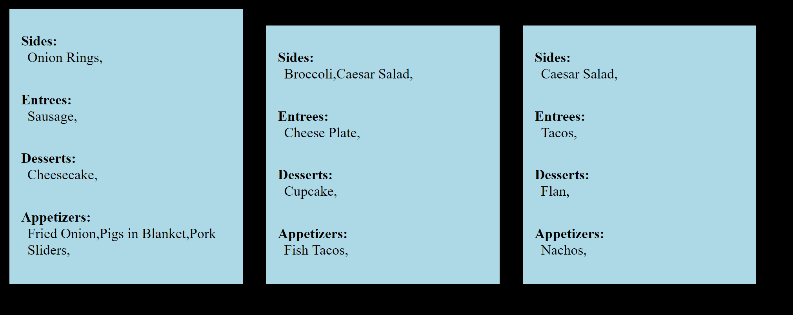

# EzOrdr: Ordering Made Easy
## Team Name: EzOrdr
## Team Number: 2
### Group Members: Samuel Steinberg, Ethan Grissom, Viktor Zenkov, Aaron Johnson

## Overview
EzOrdr is designed for use at restaurants, by providing a direct line of communication between the chefs of the establishment and the patrons. This is accomplished through two distinct interfaces, the interface the kitchen (chefs) interacts with and the interface the customer submits their order with, which are connected through a Mongo database. To further clarify, the kitchen views the orders in the form of a queue. Each element in the queue is first marked as incomplete, and it is the kitchens role to mark orders as complete as they are completed, thereby popping the order from the visual queue but still keeping the order stored on site. The virtual customer menu is styled for aesthetic purposes. The customers’ order is sent to Mongo as a JSON object and is extracted via AJAX calls, and is then added to the kitchen queue page with JavaScript. The application was written on Visual Studio Code on a Flask framework. The motivation for this project was the desire to design a simple but powerful product beneficial to both the restaurant and the customer. This is accomplished by making ordering easier for patrons by taking out the filter (waiter) between their food order and the creator of their food, the chef, so that the order of the patron is exactly what they receive. This will also and cut costs for restaurants significantly, as they will not need nearly as many employees that are not involved in actually making the food and they will not waste nearly as much food in the form of receiving the wrong order (mistakes by the waiter/waitress). 
In terms of the current market, our product meets a legitimate need. Currently, there are three main types of restaurants: traditional sit-down, buffet, and ordering in a line (such as Chipotle, Cava, Moes, etc). Our product fits between ordering in a line and traditional sit-down for those who would like the traditional formal meal, but with the ease and simplicity of ordering in a line. With the widespread availability of tablets, many for under $100, our idea of connecting the patron and kitchen would be of little expense and in the end save restaurants significant amounts of money by making waiters obsolete and requiring only bussers for the customer experience. Additionally, this also fits in line with today’s political climate. Specifically, calls for a $15 federal minimum wage have been growing with more widespread support, causing significant concerns about costs, cutting staff, and reducing many employees to part-time in the restaurant/hospitality industry. EzOrdr would cut costs to the point where this shift in wages would not significantly affect workflow and allow employees to remain full-time since overall staff would be fewer than the typical restaurant. Another political issue has to do with the Affordable Care Act, which makes employers provide healthcare to all employees if they have more than 49 employees. Since many restaurants cannot afford to pay this, our product would make staying at 49 employees or under much more feasible. 
To put our project in context, we are designing this product to cut the costs of restaurants and to make ordering as simple as it should be for a customer. Additionally, we believe this satisfies the need of a fusion between a traditional restaurant and the simplicity of ordering in a less-traditional environment along with being prepared for changes that could be brought on in the realm of politics.
If we could make any major changes; it would be designing the project in Node.js and not a Flask framework. With all the moving parts, it would have made things much simpler/smoother to develop it all on Node.
Overall, we completed our project goals. We have a working application that can be scaled and built upon and serves its purpose. With time permitting we would have also built an administrative interface that would oversee both the kitchen and customer interfaces and would be able to change menu layout without physically entering the code.

## Customer Value
There have been no changes in regard to the value our system offers to the customer. The value we bring to a customer has been consistent throughout.

## Technology
After completing the implementation of our minimum viable system (MVS), our goals were to scale up. Though we could extract from our database and send one order for our MVS, there were changes we have to make to our framework to extract more than one. For example, our backend was not suitable to handle multiple JSON objects. This became an issue when we were sending the orders as an array of JSON objects, and required the bulk of our time to make the changes. Another feature was added to constantly refresh the page and database, taking out another manual aspect. Additionally, the code for our front-end was cleaned up and made more visually appealing. The last element we needed after the MVS was dynamic element creation, which took the least amount of time to complete with documentation plentiful. Below is an example from our queue page with multiple orders. To mark an order as finished, all it takes is a simple click.
\

