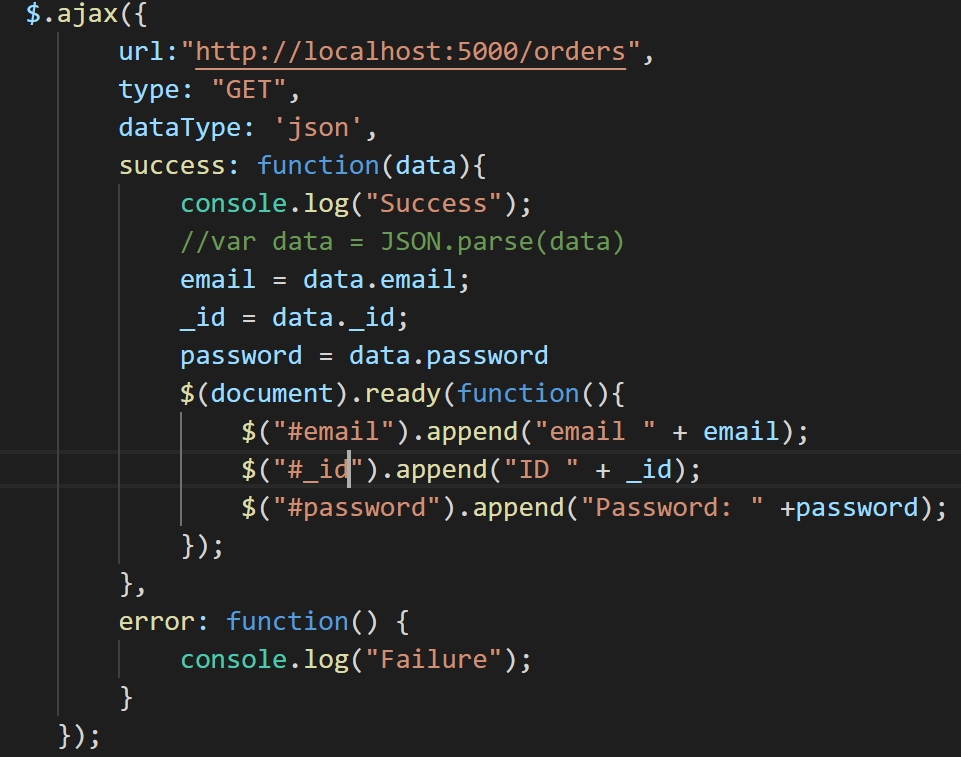

# EzOrdr: Ordering Made Easy
## Team Name: EzOrdr
## Team Number: 2
### Group Members: Samuel Steinberg, Ethan Grissom, Aaron Johnson, Viktor Zenkov

## Introduction
As of March 11th, 2019 our group has accomplished its goals at this stage in the project. Our goal of creating a minimum viable system has been realized, as we have been able to submit an order (from a customer), receive that order (store it in the database), retrieve that order (extract it from the database), and display that order to the service side of our application. The most significant part for our team has been the database set-up and service, since none of our members have had any experience prior. We set aside a bulk of time for this, and ended up finishing slightly ahead of schedule. Other accomplishments include integrating multiple languages interacting with each other and having a flow of languages: HTML/CSS -> JavaScript -> JSON -> MongoDB -> AJAX -> JavaScript -> HTML/CSS. We are also using a Python back-end. We have not changed our requirements but have made major changes to design and major events. Contrary to our original design of the system, we will not strictly use MongoDB and have changed our framework to Flask, which has allowed us to have a much more stable framework. Our team is still using MongoDB, but only to store data sent by the customer (JavaScript objects converted to a JSON). This is extracted by the kitchen side using Ajax. We chose to use Ajax because it is much easier to integrate with JavaScript and create the necessary HTML elements, since we need to display items/orders. In terms of major events, we completely switched frameworks (using Visual Studio Code with Flask) and in doing so our priorities shifted. We had to learn how to make our application more intelligent and integrate multiple moving parts into one synchronized system. Our timeline shifted slightly due to these changes.

## Customer Value
There have been no changes in regard to the value our system offers to the customer. We are still intent on improving our minimum viable system to create a smoother product.

## Technology

**Architecture**: We are using the Flask framework to support our system. We are designing and supporting two separate entities on it: One for the customer and the other for the business (since this is for restaurants, it is usually denoted as the “kitchen” side). Since we are using Flask, our back-end is written and supported in Python. The customer page is built in HTML/CSS and JavaScript. When the user clicks a “submit” button, all of their checked items in their order are collected in the JavaScript and put into a JSON object. This JSON object is then sent to a MongoDB database collection. On the kitchen end, these objects are retrieved from Mongo using jQuery’s Ajax. This does the parsing of the JSON for us, and we then create the HTML elements with them. Below is the general flow of information as passed between languages:\

\
**Goals**: The goal for this iteration was to send one complete order, which we have viewed as our minimum viable system. This was a realistic goal since we had to take into account the learning curve for working with databases, where small issues could take long periods of time to debug. Our next iteration will be transforming this minimum viable system into a working prototype.\
**What Works?** Currently, our database insertion and extraction is running, the HTML/CSS of the user interface is nearly complete, and the kitchen interface is on its way. Below is a photo of our initial extraction (which is trivial, but gives an idea of what is working):\

\
The above code snippet in Figure 1 represents the successful communication between interfaces. This was a very important aspect of our minimum viable system.\
**Tests Conducted**: We have performed mainly manual testing up to this point. Since this project is based off the web, functions are tested in the browser. Testing for the database are made by physically accessing the database to check for insertion. Successful extraction is output to the page, while unsuccessful extraction breeds an error message and location of the error.\
**Future Goals**: In the immediate future, our goal is to improve actual functionality of the system. This will mainly entail adding necessary features to the system such as a page re-direct after an order, a better kitchen display interface, and increased efficiency in extraction. Looking beyond this, our goal is to add sufficient functionality to have a prototype. This project is unique in the sense that the main difference between our minimum viable system and prototype is efficiency and added features, in addition to later add-ons such as payment methods. Also, we will need to alter refresh speeds due to being hosted on the web (this might be included in the functionality part, but it is of extreme importance) for the next iteration.

## Team
**Member Responsibilities**
* Samuel Steinberg: was responsible for creating and designing the initial Customer interface, along with setting up the database retrieval.
* Ethan Grissom was responsible for setting up our framework, and with setting up the MongoDB database and storage.
* Viktor Zenkov was responsible for general assistance and general scripting.
* Aaron Johnson was responsible for general assistance and gathering ideas for a more aesthetically pleasing user interface.  

**Roles Going Forward**: Roles will generally shift to members writing JavaScript and HTML code for specific portions of the project. This is because the framework and databases are already set up. Any further work with them will mainly have to do with how we store the objects and the fields we add/subtract along the way. These changes will be reliant on the structure of our code and how it may or may not shift throughout the project.

## Project Management
Our product is on schedule. We did not expect to have a honed product at this stage, and we do not. We do, however, have a minimum viable system that is a stable base by which we can add features. It was expected that the back-end and database work would take up a significant portion of time, but now that that portion is completed progress should speed up. There have been no alterations to the timeline and we would still like to have a prototype completed by early April.

## Reflection
The user interface and design was generally successful. There were minimal issues (had to adjust for different browsers/zoom percentages) and went smoothly. Additionally, initial feature code has been successful, with data sending on submit and checked items appearing in the total bar. Though nothing, so far, has gone “bad”, the database portion was not a smooth process. As stated above, no group members had any experience with databases and there was a significant learning curve involved. Additionally, no group members have worked with jQuery/Ajax before. Going forward, we will do more pair programming. Outside of class, we did not meet many times; but when we did there was significant progress made. This type of collaboration is especially helpful since this project requires a large amount of communication and collaboration, since every aspect of the project is intertwined with one another.
